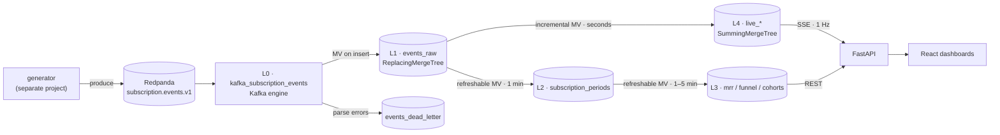

# Riffle

**Real-time subscription analytics.** Redpanda into ClickHouse, four dashboards, and an
honest answer about which numbers actually need to be fresh.

> *riffle* · n. the fast, shallow stretch of a stream where the water runs over stones

Riffle ingests a stream of subscription lifecycle events — purchases, renewals,
cancellations, billing failures, refunds — models them into subscription periods inside
ClickHouse, and serves MRR, trial conversion, churn, cohort retention and a live
operations view over the result.

The event generator is a **separate project**. The contract between the two lives here,
in [`contracts/`](contracts/), and is versioned.

---

## The design decision

Raw events are not what the dashboards need. Every metric is computed over *subscription
periods* — one row per subscription per billing cycle — and deriving those from an
at-least-once, unordered event stream is the actual problem.

MRR and retention do not benefit from real time. A retention curve recomputed every four
seconds is indistinguishable from one recomputed hourly, and pretending otherwise costs
correctness: refunds arrive weeks late, cancellations get backdated, grace periods resolve
after the billing period closes. Every one of those **rewrites the past**.

So Riffle runs two paths.



A thin **incremental** path keeps the live view seconds-fresh. A **refreshable** path
recomputes the analytical tables every one to five minutes, absorbing retroactive events
structurally instead of by cleverness.

The trade-off is stated rather than hidden: **L4 is not authoritative.** A live ticker
briefly off by one event is correct behaviour; a revenue figure briefly off by one event is
a bug. L2 and L3 answer questions about money.

Full rationale: [`docs/design/2026-09-08-riffle-design.md`](docs/design/2026-09-08-riffle-design.md).

---

## Quickstart

Requires Docker, [uv](https://docs.astral.sh/uv/) and Node 22.

```bash
make up          # Redpanda + ClickHouse, waits for health
make install     # sync the API virtualenv
make migrate     # apply ClickHouse migrations
make test        # unit + integration
make demo        # everything, including the API and web app
```

Then:

| | |
|---|---|
| Dashboard | <http://localhost:5173> |
| Pipeline health | <http://localhost:8000/api/health/pipeline> |
| API docs | <http://localhost:8000/docs> |
| Redpanda HTTP proxy | <http://localhost:18082> |

Publish an event by hand:

```bash
curl -sS http://localhost:18082/topics/subscription.events.v1 \
  -H 'Content-Type: application/vnd.kafka.json.v2+json' \
  -d "{\"records\":[{\"value\":$(cat contracts/examples/initial_purchase.json)}]}"
```

`make help` lists every target.

---

## Layout

```
contracts/           JSON Schema for subscription.events.v1, plus examples
clickhouse/
  migrations/        numbered SQL, applied once each by riffle-migrate
  config/users.d/    server settings (refreshable MVs, async insert)
api/                 FastAPI query + health service, and the migration runner
web/                 React + TypeScript dashboards
docs/design/         the design document this was built from
```

---

## Status

| | Milestone | State |
|---|---|---|
| **M1** | Ingest spine — compose, Kafka engine, `events_raw`, dead letter, smoke tests | **done** |
| M2 | `subscription_periods` + MRR dashboard — one vertical slice through every layer | next |
| M3 | Live operations view — L4, SSE, freshness indicator | |
| M4 | Trial funnel & churn — cohort-aligned, voluntary vs. involuntary | |
| M5 | Cohort retention & LTV | |
| M6 | Adversarial suite & README demo | |

The adversarial tests are the point of M6, and three of them already run in M1:
duplicate delivery collapses to one row, a malformed message lands in the dead-letter
table rather than vanishing, and `ingest_ts` is stamped on arrival where no producer can
forge it.

## Licence

MIT — see [LICENSE](LICENSE).
